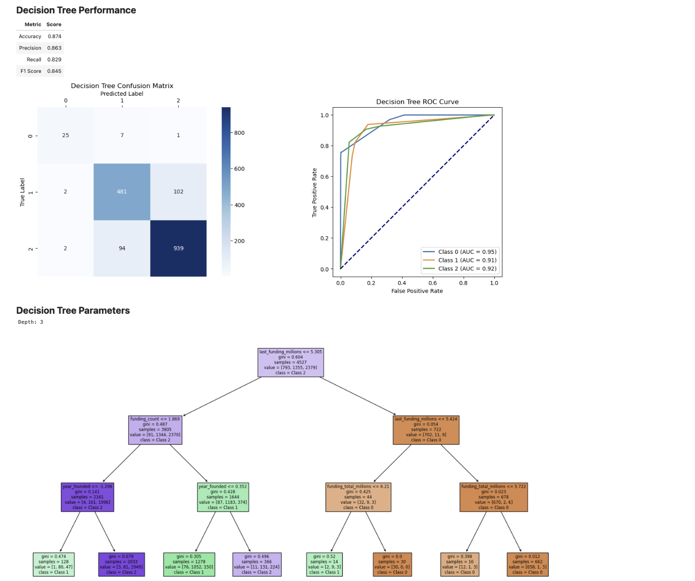
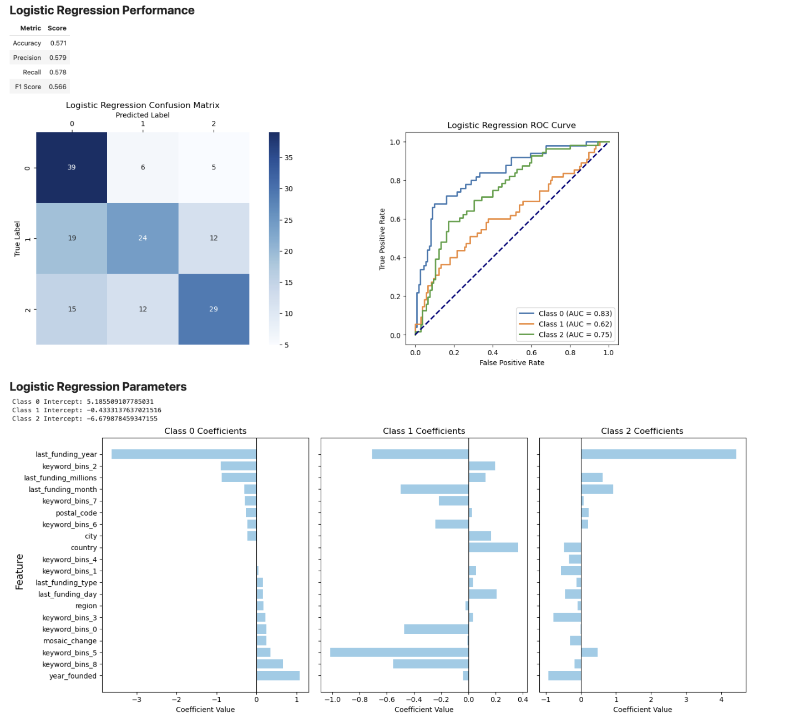
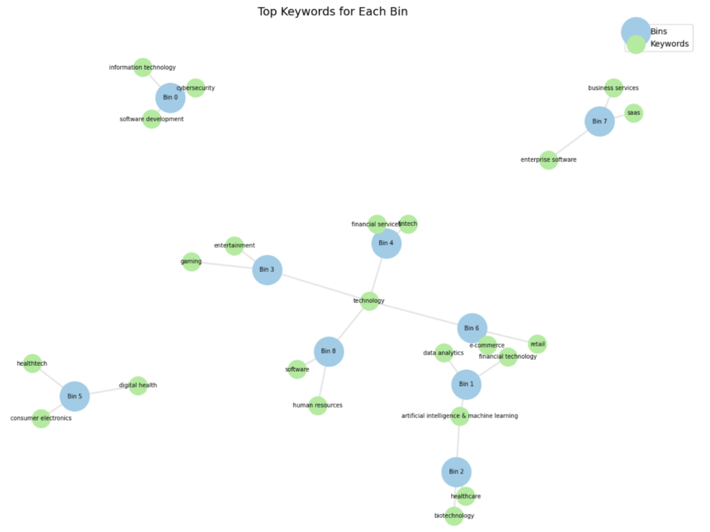
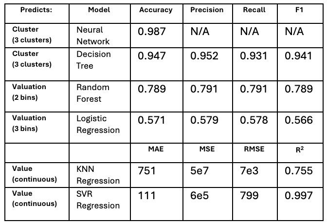

# Conclusion

## Key Results
In this report, we answer some key questions, including which measurements best predict startup success potential, how much sentiment impacts startup success, whether the industry of a startup affects its success potential, how industry information can be harnessed to predict startup performance, and more. 

For the models with more information (potentially overfitted), we found that the best indicators of startup success were:

- Latest funding amount
- Number of funding rounds
- Year founded

This is clear from the decision tree which splits on the features that the greatest information gain. 

For the models with less information, we found that the best indicators of startup success were:

- Latest funding year
- Keyword bin 5 (healthtech, digital health, & consumer electronics)
- Keyword bin 8 (software, technology, & human resources)
- Last funding month
- Country

This is clear from the logistic regression which has weights that represent the relative importance of each feature in predicting the outcome. 

The bins are shown in the graph below:

Here is a summary of model performance:

With the complex nature of the problem, we have provided investors with multiple options for models to choose from to best suit their goals. If valuation information is ambiguous or not particularly useful as a metric of future success, as it likely would not be for many industries and to certain investors, users of our models should feel secure that we have used K-means clustering to identify startups with characteristics indicative of success, and that either our neural network model or our decision tree model would predict whether a startup should be associated with these unique companies or not with high accuracy. If valuation information is useful to predict, we recommend our SVR to find the value of a startup with extremely high precision, and our Random Forest model as a classifier if exact numerical outputs may not be useful or as a corroboration to the SVR results.  

## Future Work
The key next step to truly test the efficacy of our models would be to scrape more data from OurCrowd, CB Insights, or other sources, and test how well our models perform with these new sources of information. Several rounds of scraping and testing would likely be required to smooth out any errors in predictive ability. If models could continue to be fed new data and improved, after many rounds of testing these models might be ready to be tested with real investment capital on real companies.   

Our K-means clustering could also be improved upon or tested with different values of K, to narrow in on truly successful startups as opposed to nearly successful ones.   

Examining the work of others in this field yields areas for exploration as well as confirmation of the methods we applied. Bidgoli et al employed many of the same machine learning techniques we did, achieving a best accuracy of around 80%, and utilized K-means clustering to help distinguish successful startup characteristics [1]. Gautam and Wattanapongsakorn achieved accuracy scores of around 80% using techniques such as XGBoost and LightGBM, but with a larger dataset of 2 million companies [2].  

Undoubtedly, the task of predicting startup success is a difficult one, and even high accuracy scores from machine learning models cannot guarantee whether money will be gained or lost by venture capitalists who actually invest in them. However, our methods for finding and creating usable data were thorough, and our models provide an excellent jumping-off point for further analysis. With more robust data and iterative training of our models, we may be able to create tools relied upon by savvy investors in time.  

**References**

[1] 	Bidgoli, M. R., Vanani, I. R., and Goodarzi, M. 2024. Predicting the success of 		startups using a machine learning approach. Journal of Innovation and 		Entrepreneurship 13, 1 (2024). DOI:  
https://doi.org/10.1186/s13731-024-00436-x. 

[2] 	Gautam, L. and Wattanapongsakorn, N. 2024. Machine Learning Models to 		Investigate Startup Success in Venture Capital Using Crunchbase Dataset. IEEE. 	DOI: https://doi.org/10.1109/jcsse61278.2024.10613650. 

<a href="https://wihi1131.github.io/Data-Mining-Project/">Home</a>
