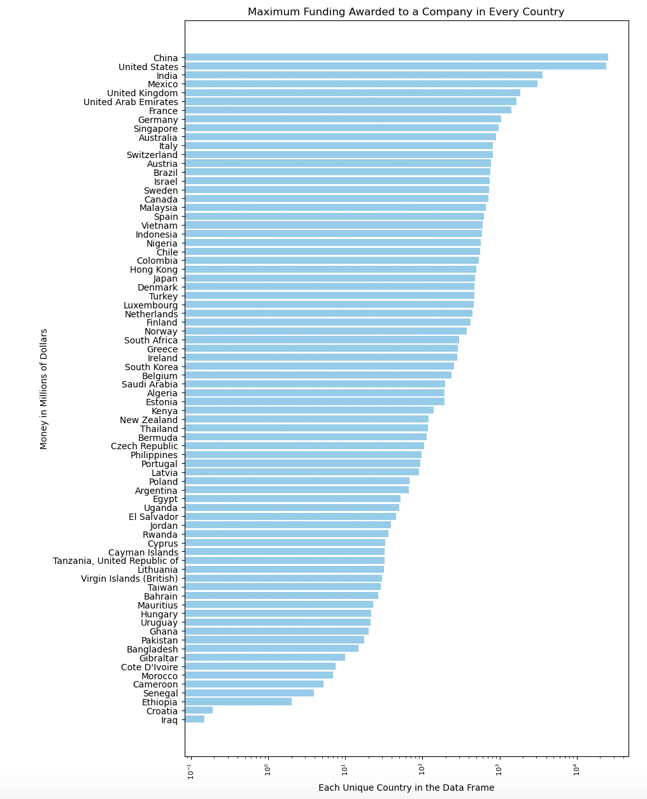
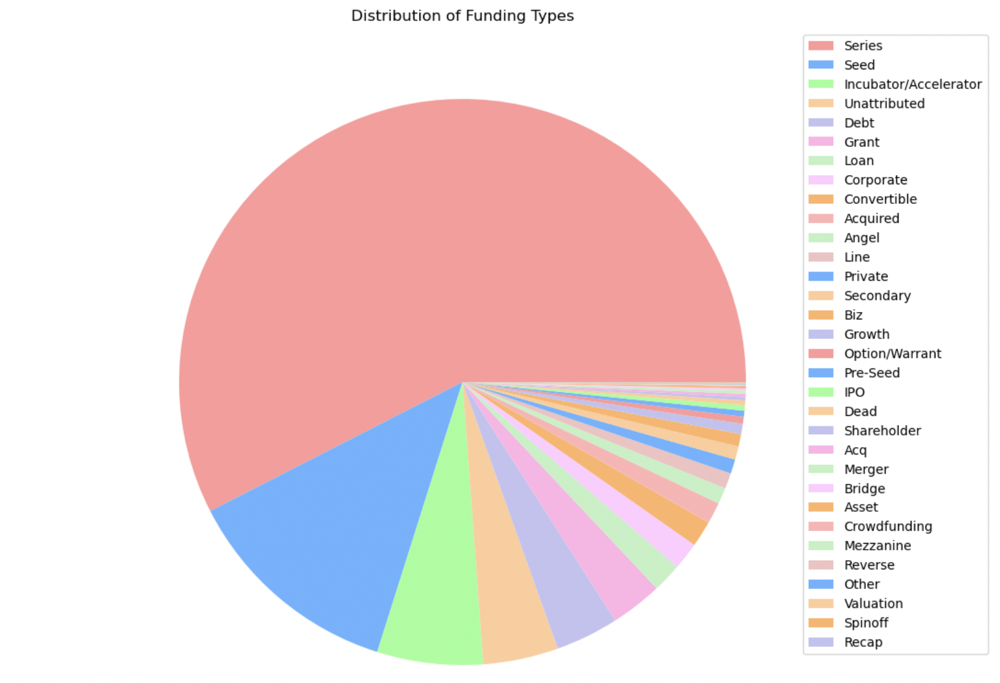

<header>
        <h1>Data Cleaning</h1>
    </header>
The financial and profile data used was gathered via web-scraping and by pulling API's from various sources. Initially, the data was separated so the financial data could be preprocessed. "Not a Number", or NaN, values were spread through various columns including: investor_count, funding_count, funding_total, funding_last, funding_last_date, valuation, valuation_date, revenue_year, and revenue_total. The length of the dataset totaled almost 7000, so columns that contained less than 20% NaN values, we replaced with the median of the column. We decided to replace these values with the median rather than the mean because the distribution of each column was positively skewed. Indicating that each distribution contained outliers, and therefore, the mean wouldn't be a good measure of the midpoint of the data. A further in-depth explanation of the cleaning process can be found in the cleaning.ipynb folder. 

<header>
        <h1>Data Visualizations</h1>
    </header>

<main>
    

        <figure>
            <figcaption>1. This graph illustrates the maximum amount of funding an individual company recieved in each country. This will               be vital to our analysis because we can predict if a company will recieve more funding based on the country they founded                their company in.</figcaption>
             
        </figure>
        <figure>
            <figcaption>2. This pie chart illustrates the last funding type an individual company recieved. This information will be                    important to our analysis because we can predict the success of a company based on the type of funding that they recieved.             </figcaption>
            
        </figure>
    

</main>
<a href="https://wihi1131.github.io/Data-Mining-Project/">Home</a>
