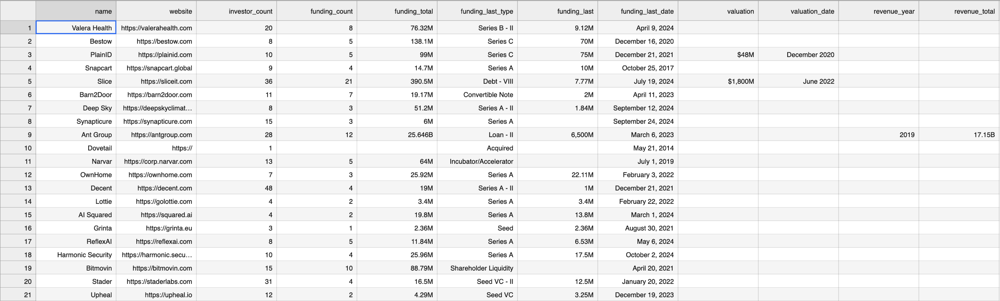
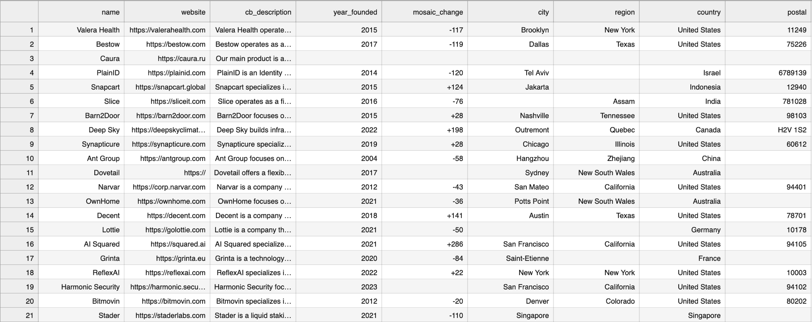
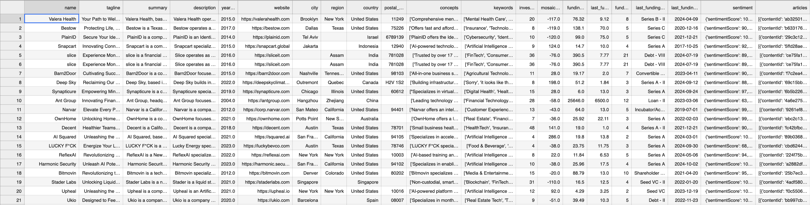
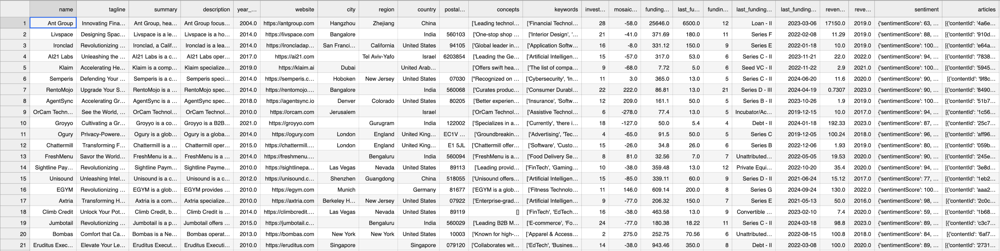
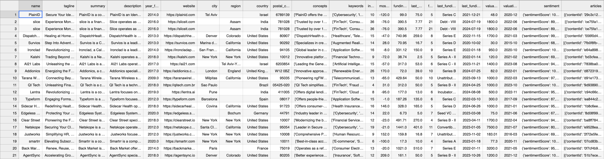
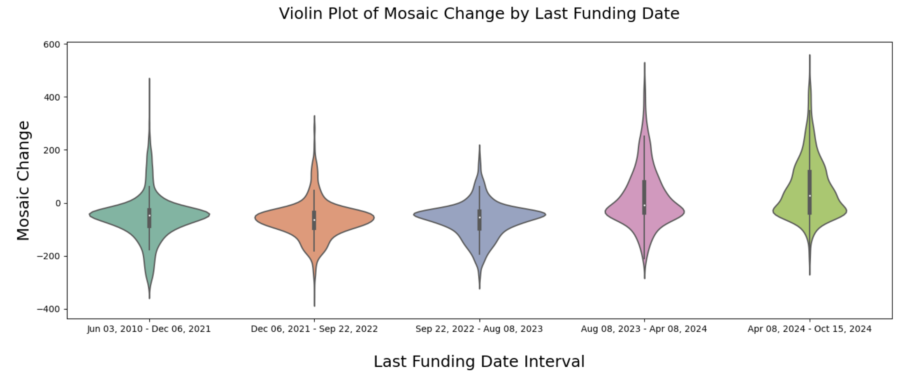
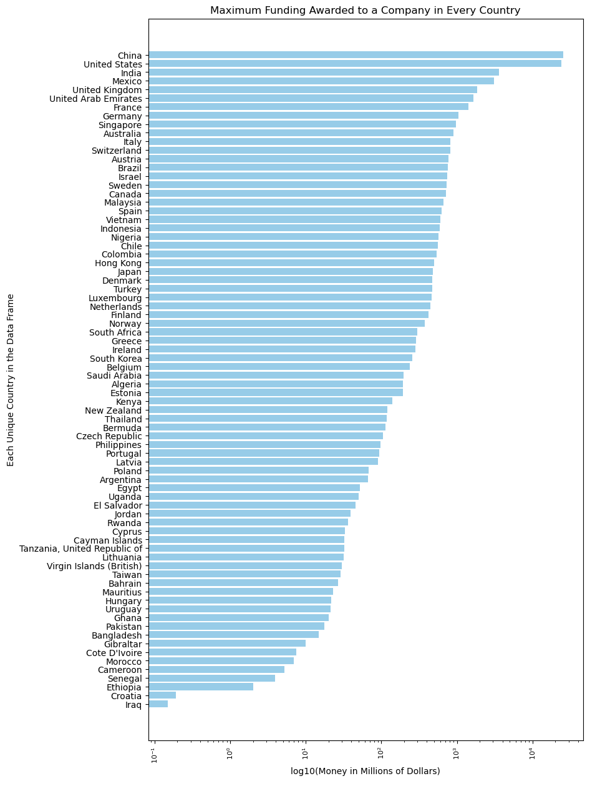
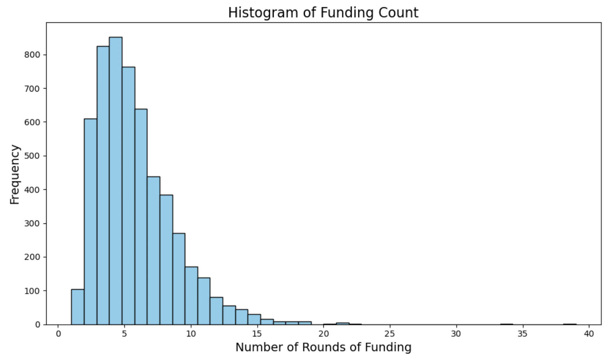

<header>
        <h1>Abstract</h1>
    </header>
Investors have a lot to consider when investing in a startup. Our aim is to use data mining to create predictive models that simplify this process. Accurate models require a large volume of data. In Milestone 2, we have scraped, cleaned, integrated, and explored the data we need to build our models. We discuss how we scraped, cleaned, integrated our data, then how we used exploratory data analysis to visualize it. In total, we have created one primary dataset and two subsets of that primary dataset. In the next milestone, we will use the appropriate data for our models.  

<header>
        <h1>Data Collection</h1>
    </header>
Our data was scraped from two different websites. First, we checked robots.txt for permission, then slowly scraped each website to avoid overwhelming their servers. The scraping process went as follows: A request was sent to the webpage to obtain an HTML/JavaScript document, then the document was parsed and searched using Beautiful Soup 4, then the information we needed was extracted using regular expression matchers, and finally the information was stored, then written to a CSV file. To obtain URLs to scrape, we consulted *robots.txt* for sitemaps, XML documents containing URLs. The first website we scraped was OurCrowd, which gave us a base list of URLs. Using this base list of URLs, we scraped CB Insights as well. 

The first website was OurCrowd, which for each startup has information like name, website, industries, a summary of what the startup is about, and a sentiment score with a collection of articles. Here is an example of a page that was scraped for a startup called Ro that does online physician screenings: <https://www.ourcrowd.com/companies/ro>. 

The second website, CB Insights, has two tabs, both with pertinent information. The first tab we scraped was the financials tab. This contains information about investors, funding totals, most recent fundings, and for some startups valuations and revenue amounts. Here is an example webpage of the financials of Ro on CB Insights: <https://www.cbinsights.com/company/roman-health-ventures/financials>. The second tab we scraped was the overview tab, which contained information about founding years, mosaic score changes, a description, and the location for each startup. Here is an example webpage of the overview of Ro on CB Insights: <https://www.cbinsights.com/company/roman-health-ventures>. 

<header>
        <h1>Data Cleaning</h1>
    </header>
Three datasets: financial, profile, and overview were gathered via webscraping. Cleaning the datasets was a two-step process. First, we imputed and dropped missing values, then we converted each initial data type to its appropriate type.  

For imputation, we started by viewing how many null values each column had. If the column was a numerical type and the null values made up less than 25% of the total rows, we would impute the missing values. Our datasets had 5000-7000 rows each, so we imputed the values of a lot of columns. We plotted the distribution of each column and used median if it was moderately-to-strongly skewed to negate outliers and skewness. Otherwise, we would use mean or mode. In most cases the distributions were skewed.  

For type conversion, we started by viewing the types of each column, then converted *object* types to more narrow types. For example, categorical types such as funding type were converted into categories to improve space efficiency. Integer types such as investor count were changed to *Int64* types from *float64* types. With date and time information, we formatted these columns for ease of use. We converted these to *datetime* types, and then stored them as formatted *strings* (which are stored as *objects* but now properly formatted). 

A step-by-step explanation of the cleaning process can be found in *cleaning.ipynb* under the *cleaning/* directory in our repository: <https://github.com/WiHi1131/Data-Mining-Project/.> 

<header>
        <h1>Data Integration</h1>
    </header>
After scraping and cleaning, we had three datasets. While scraping each website, we collected the homepage URL of the startup being scraped, so the integration process of the cleaned datasets was straightforward. We performed an inner join on the profile dataset with the financial dataset on the column *website*. Then, we performed another inner join using the column *website* on that combined dataset and the overview dataset. In the end, we created a primary dataset called *primary.csv* under the *clean-datasets/* directory. After integrating our cleaned datasets to create a primary dataset, we decided to create two mini-datasets also under *clean-datasets/*. One contains the startups from primary with complete revenue information, and the other contains startups with complete valuation information. Revenue and valuation data were sparse in the primary dataset but may be useful for model building. Finally, we dropped the revenue and valuation columns from the primary dataset.

<header>
        <h1>Before Cleaning and Integration: </h1>
    </header>

profiles.csv

financials.csv

overviews.csv

<header>
        <h1>After Cleaning and Integration: </h1>
    </header>

primary.csv

primary-with-revenue.csv

primary-with-valuation.csv

<header>
        <h1>Data Visualizations</h1>
    </header>

<main>

<header>
<h2>1. Mosaic change vs date of most recent funding </h2>
</header>

The mosaic score for a company is an internal metric designed by CB Insights for evaluating the long-term success of startups. Without a paid account, only the mosaic score change was available to scrape for each startup. This plot puts startups into bins based on their most recent funding date, then creates a violin plot for each bin to show the distribution of its mosaic score changes. From this plot, we can see that startups that have recently received funding tend to have more positive mosaic score changes. This intuitively makes sense: if a startup has not been funded for a long time, it is less likely to be a long-term success.  

<header>
<h2>2. Number of startups by country </h2>
</header>

We have the country information for each of our startups, so we can plot a map showing how many startups are in each country in our dataset. From this plot, we get an idea of where the startups we are analyzing are located, and we can also decide if there are countries we want to drop or countries we want to gather more data for.  

<header>
<h2>3. Most common words in startup descriptions  </h2>
</header>

Each of the startups in our dataset has a description written by CB Insights. Using these descriptions, we can extract the most common words and create a frequency plot. Some of the descriptions contain city names, so we are getting common city names and removing them from the descriptions before processing the words. We are also moving stopping words like 'the', 'and', and 'but'. From this frequency plot, we can get an idea of what types of companies we are looking at, and what the most popular areas are.  

<header>
<h2>4. Maximum funding awarded to a company in every country</h2>
</header>

This graph illustrates the maximum amount of funding an individual company receives in each country. This will be vital to our analysis because we can predict if a company will receive more funding based on the country, they founded their company in. 

<header>
<h2>5. Most recent funding type</h2>
</header>

This pie chart illustrates the last funding type an individual company received. This information will be important for our analysis because we can predict the success of a company based on the type of funding that they receive. 

<header>
<h2>6. Box plots</h2>
</header>

Boxplots were created for each relevant numerical variable to get a visual indication of central tendency and spread of each attribute. 

<h3>Investor Count: </h3>

This boxplot shows a median of 10 investors, with the middle 50% of the data lying close to the median, a low whisker of 1 and a high whisker a bit higer than 25. The data appears somewhat symmetrically spread with a bit of a right skew towards higher numbers of investors, and a significant number of high outliers.

<h3>Mosaic Change: </h3>

This boxplot shows a smaller negative mean, and a very symmetrical looking spread, with a very small right skew. There are a significant amount of both high and low outliers. 

<h3>Funding Count: </h3>

This boxplot shows a heavy right skew, but a symmetrical middle 50% of the data, with a median of 5 (close to the mean) of the number of rounds of funding. There are high outliers but less outliers than in previous boxplots. 

<h3>Funding Total: </h3>

This boxplot is undiscernible because of the significant high outliers. Removal of the top 50 outliers was conducted and the data replotted: 

This boxplot is now discernible due to removing outliers. We see a very small median with a heavy right skew, and still a significant number of very high outliers. The lowest whisker is close to 0 and not below. 

<h3>Sentiment Score: </h3>

After sentiment scores were extracted, summary statistics were generated and this boxplot was created. We see a very high mean of around 92, indicating that most sentiment scores are very high. This is likely due to bias in selecting startups that were able to gain high amounts of funding (with a mean of 114 million USD). This boxplot shows most of the data being very close to 100. There is a strong left skew to this data and plentiful low outliers. 

<header>
<h2>7. Histograms</h2>
</header>

Histograms were created for each relevant numerical variable to get a visual sense of the distribution of each attribute.

<h3>Investor Count: </h3>

This histogram looks mostly normally distributed around the mean/median, with a long right-handed tail.   

<h3>Mosaic Change: </h3>

This histogram appears symmetrical and has a very large peak around the mean – there is a slight but noticeable right skew.   

<h3>Funding Total: </h3>

This histogram is heavily right skewed. Most of the data is located close to 0. We know the mean is above 100, but this is likely heavily influenced by outliers, making the median a more robust measurement at 31 million. 

<h3>Funding Count: </h3>

This histogram looks slightly normal, being unimodal, but also containing a long right-tail.  

<h3>Sentiment Score: </h3>

This histogram shows that most sentiment scores are 100, with a very long left-handed tail. The mean is close to the median even with so many outliers, indicating how many values are directly at 100. It may be worth further investigation to find out how sentiment score is determined and if it has much meaning to our analysis.  

<header>
<h2>8. Q-Q-plots</h2>
</header>

QQ-plots were created for each relevant numerical variable to visually determine how normally distributed they were. We can visually measure how close the distribution of each numerical variable is to the theoretical Normal distribution by how closely they approximate the straight red line in each plot. Each variable shows a marked difference between its distribution and a normal distribution. The Mosaic score is the most normally distributed variable, as it is the closest to the straight line. Both Funding Total and Sentiment Score show the most significant deviations, as we have seen already in above plots - both of these variables had peaks at one end of their value ranges or the other. Investor Count and Funding Count showed distributions in between these two aforementioned plots, not being completely normally distributed by any means, but closer than Funding Total and/or Sentiment Score. The deviation from a Gaussian distribution for each variable indicates that normalization may be worthwhile for all numerical variables.  

<header>
<h2>9. Keywords vs sentiment score</h2>
</header>

To understand more about how keywords may have influenced sentiment analysis, we created a separate dataframe that aggregated the average sentiment value score for each industry keyword present in the dataset. We iteratively updated the average sentiment score for each keyword as it was encountered in the dataset, and also counted the instances of each keyword present. This graph shows the average sentiment score for each industry keyword and the number of each keyword present in the dataset. We do not see hardly any variation here. This is likely a good indication that our dataset is fairly biased, either in the way that sentiment scores are calculated, or in the fact that every startup in the dataset is very successful, having been able to secure 114 million dollars of funding on average, so it is likely that these industry buzzwords associated with the industry of each startup all are attached to very positive sentiments.

<header>
<h2>10. Pairplot</h2>
</header>

We can see some potentially positive relationships, especially between the funding count and the investor count. This intuitively makes sense, as you would expect more rounds of funding as the number of investors increased. Overall, though, the data looks very scattered with very little indication of linearity between any of the numerical variables. We would perhaps expect that more investors and more total funding, for example, would have a stronger positive relationship. We see this somewhat, but it does not appear to be a very strong linear relationship. This does not bode well for future model-building. Let's look at a heatmap showing correlation coefficients between each numerical variable: 

We can see some potentially positive relationships, especially between the funding count and the investor count. This intuitively makes sense, as you would expect more rounds of funding as the number of investors increased. Overall, though, the data looks very scattered with very little indication of linearity between any of the numerical variables. We would perhaps expect that more investors and more total funding, for example, would have a stronger positive relationship. We see this somewhat, but it does not appear to be a very strong linear relationship. This does not bode well for future model-building. Let's look at a heatmap showing correlation coefficients between each numerical variable. 

<header>
<h2>11. Heat map</h2>
</header>

This heatmap shows color-coded correlation coefficients between each numerical variable, with a stronger correlation being the reddest, and the weakest being the bluest. We immediately notice how most of the heatmap is very blue, with almost no correlation between most variables (with extremely small coefficients, a few even being 0). We see a moderate positive correlation between funding count and investor count, and a weak positive correlation between total funding and funding count and total funding and investor count. But most variables appear to be as uncorrelated as possible. Again, this will prove to be a problem for further model-building and analysis, and we may need to explore other sources of data to create effective models. 

</main>
<a href="https://wihi1131.github.io/Data-Mining-Project/">Home</a>
