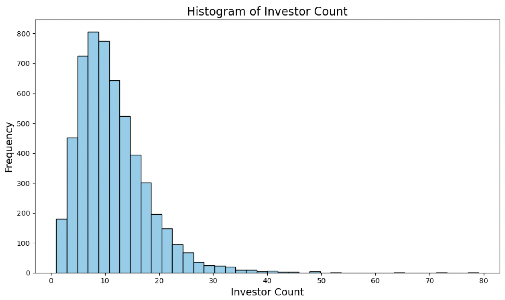
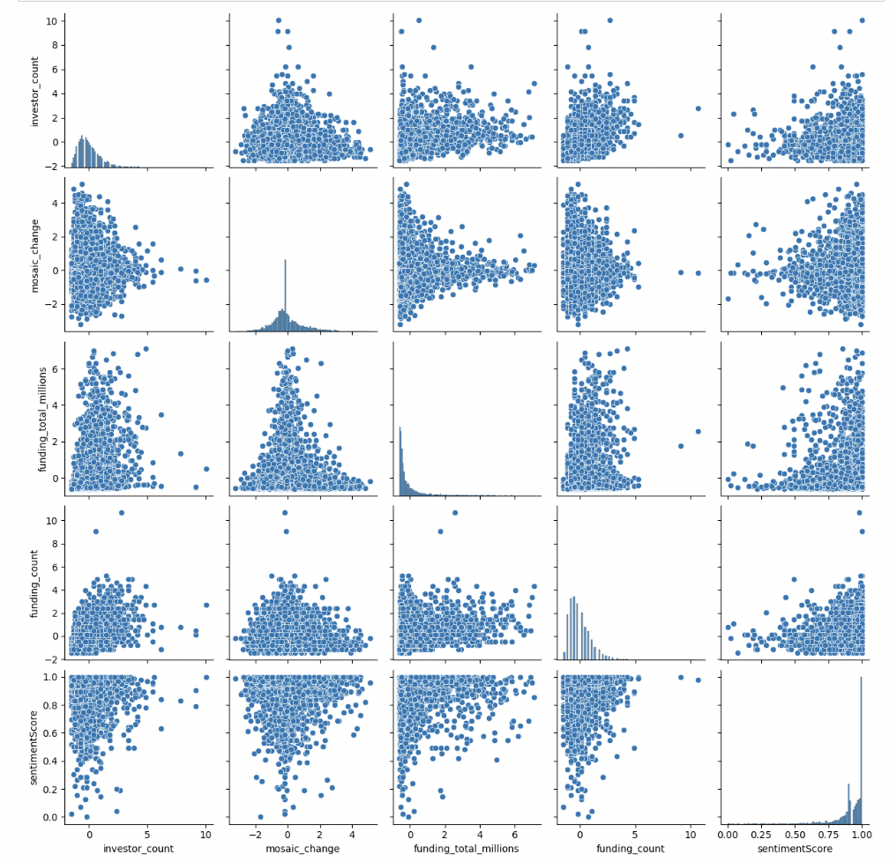

<header>
        <h1>Abstract</h1>
    </header>
Investors have a huge number of factors to consider when deciding whether to invest in a startup and how much to invest. Our aim is to use data mining to implement predictive models that simplify this process. Creating accurate predictive models requires a large corpus of data. In Milestone 2, we have scraped, cleaned, integrated, and visualized the data we need to start building our models. We will start by discussing how we scraped data from two websites, then explain how we cleaned the data, then how we integrated the data, and finally showcase our findings from performing exploratory data analysis.  

<header>
        <h1>Data Collection</h1>
    </header>
Our data was scraped from two different websites. The general processing of webscraping was to first check robots.txt for each site for permission, then slowly scrape each website to avoid overwhelming their servers and to not get blacklisted. The scraping process was typically as follows: First a request is sent to the webpage to obtain an HTML/JavaScript document, then the document is parsed and search using Beautiful Soup 4, then the information we are looking for is obtained using regular expression matchers, and finally the extracted information is stored, then written to a CSV file.  

To obtain specific URLs to scrape for each site, we consulted the sitemaps that were listed in robots.txt, which were XML documents containing a list of URLs. The first website we scraped was OurCrowd, which gave us a preliminary base list of URLs. Based on these URLs, we scraped the corresponding URLs for CB Insights, which we found in its sitemaps. 

The first website was OurCrowd (https://www.ourcrowd.com/), which for each startup has information like name, website, industries, a summary of what the startup is about, and a sentiment score with a collection of articles. Here is an example of a page that was scraped for a startup called Ro that does online physician screenings: https://www.ourcrowd.com/companies/ro. 

The second website, CB Insights (https://www.cbinsights.com/),  has two tabs, both with pertinent information. The first tab we scraped was the financials tab. This contains information about investors, funding totals, most recent fundings, and for some startups valuations and revenue amounts. Here is an example of the webpage scraped for the financials of Ro on CB Insights: https://www.cbinsights.com/company/roman-health-ventures/financials. The second tab we scraped was the overview tab, which contained information about founding years, mosaic score changes, a description, and the location for each startup. Here is an example of the webpage scraped for the overview of Ro on CB Insights: https://www.cbinsights.com/company/roman-health-ventures. 

In the end after scraping, cleaning, and integrating the data from these websites, we were able to create a primary dataset with 21 columns and around 5500 startups.  

<header>
        <h1>Data Cleaning</h1>
    </header>
The financial and profile data used was gathered via web-scraping and by pulling API's from various sources. Initially, the data was separated so the financial data could be preprocessed. "Not a Number", or NaN, values were spread through various columns including: investor_count, funding_count, funding_total, funding_last, funding_last_date, valuation, valuation_date, revenue_year, and revenue_total. The length of the dataset totaled almost 7000, so columns that contained less than 20% NaN values, we replaced with the median of the column. We decided to replace these values with the median rather than the mean because the distribution of each column was positively skewed. Indicating that each distribution contained outliers, and therefore, the mean wouldn't be a good measure of the midpoint of the data. A further in-depth explanation of the cleaning process can be found in the cleaning.ipynb folder. 

<header>
        <h1>Data Visualizations</h1>
    </header>

<main>

<header>
<h2>Mosaic change vs date of most recent funding </h2>
</header>

1. The mosaic score for a company is an internal metric designed by CB Insights (https://www.cbinsights.com/) for evaluating the long-term success of startups. Without a paid account, only the mosaic score change was available to scrape for each startup. This plot puts startups into bins based on their most recent funding date, then creates a violin plot for each bin to show the distribution of its mosaic score changes. From this plot, we can see that startups that have recently received funding tend to have more positive mosaic score changes. This intuitively makes sense: if a startup has not been funded for a long time, it is less likely to be a long-term success. 

<header>
<h2>Number of startups by country </h2>
</header>

2. We have the country information for each of our startups, so we can plot a map showing how many startups are in each country in our dataset. From this plot, we get an idea of where the startups we are analyzing are located, and we can also decide if there are countries we want to drop or countries we want to gather more data for. 

<header>
<h2>Most common words in startup descriptions  </h2>
</header>

3. Each of the startups in our dataset has a description written by CB Insights. Using these descriptions, we can extract the most common words and create a frequency plot. Some of the descriptions contain city names, so we are getting common city names and removing them from the descriptions before processing the words. We are also moving stopping words like 'the', 'and', and 'but'. From this frequency plot, we can get an idea of what types of companies we are looking at, and what the most popular areas are. 

<header>
<h2>Maximum Funding Awarded to a Company in Every Country y</h2>
</header>

4. This graph illustrates the maximum amount of funding an individual company receives in each country. This will be vital to our analysis because we can predict if a company will receive more funding based on the country, they founded their company in. 

<header>
<h2>Last Funding Type</h2>
</header>

5. This pie chart illustrates the last funding type an individual company received. This information will be important for our analysis because we can predict the success of a company based on the type of funding that they receive.  

<header>
<h2>Box Plots</h2>
</header>

6. The boxplot shows a median of 10 investors, with the middle 50% of the data lying fairly close to the median, a low whisker of 1 and a high whisker a bit higer than 25. The data appears somewhat symmetrically spread with a bit of a right skew towards higher numbers of investors, and a significant number of high outliers.

7. The mosaic change boxplot shows a smaller negative mean, and a very symmetrical looking spread, with a very small right skew. There are a significant amount of both high and low outliers. 

8. The funding count boxplot shows a heavy right skew, but a symmetrical middle 50% of the data, with a median of 5 (close to the mean) of the number of rounds of funding. There are high outliers but less outliers than in previous boxplots. 

9. The funding total boxplot is undiscernible because of the significant high outliers. Removal of the top 50 outliers was conducted and the data replotted: 

10. This boxplot is now discernible due to removing outliers. We see a very small median with a heavy right skew, and still a significant number of very high outliers. The lowest whisker is close to 0 and not below. 

11. fill in caption 

<header>
<h2>Histograms</h2>
</header>

12. fill in caption 

13. fill in caption 

14. fill in caption 

15. fill in caption 

16. fill in caption 

<header>
<h2>Q-Q Plots</h2>
</header>

17. fill in caption 

18. fill in caption 

19. fill in caption 

20. fill in caption 

21. fill in caption 

<header>
<h2>Keywords vs Sentiment Score</h2>
</header>

22. fill in caption 

<header>
<h2>Pair Plot</h2>
</header>

23. fill in caption 

<header>
<h2>Heat Map</h2>
</header>

24. fill in caption 

</main>
<a href="https://wihi1131.github.io/Data-Mining-Project/">Home</a>
