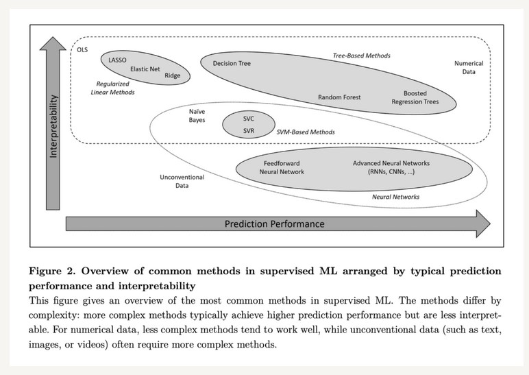
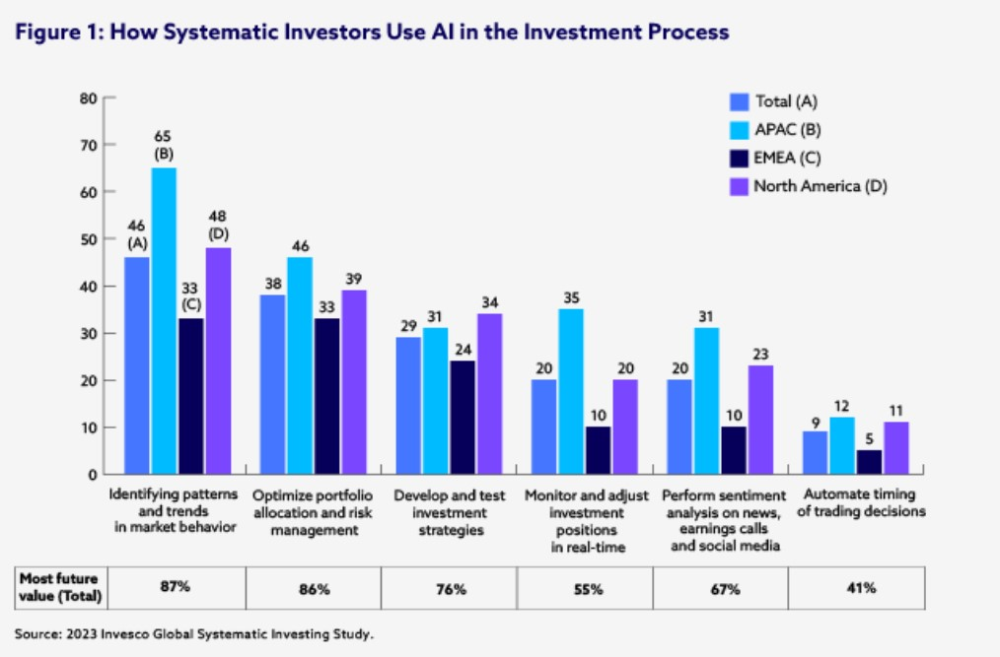

# Introduction

## Nature of the topic: 

Winning in the stock market has traditionally involved complex mathematical modeling and expensive computer simulations. Data science is already widespread in the financial world, with applications including market trend forecasting, customer segmentation, fraud detection, risk analysis, predictive analytics, and customer sentiment analysis. In this project, we will use data science to produce a multipurpose investment recommendation platform. With our help, investors will not need to be an analyst or own a supercomputer to win in the market. We will follow a multistep approach. First, we will choose a set of businesses and research their internal finance metrics such as revenue, debt-to-equity ratio (D/E), and free cash flow (FCF). Second, we will evaluate their worths using key metrics, including price-to-earnings ratios (P/E), price-to-book ratios (P/B), market caps, and growth trends. Finally, we will use text sources such as news articles and economic reports to perform sentiment analysis on their customers. After analyzing each aspect of these businesses, we will isolate the most relevant factors. Then using that information, we will create a platform that generates a profile with an investment score for a given business. The platform is aimed at three groups of people: investors, venture capitalists, and startups. Prospective investors will be able to input a list of publicly traded small businesses and easily decide which are good investments. Venture capitalists (VCs) will be able to input metrics from a startup pitch, and obtain a profile about the startup. Finally, startups will gain insights into key factors that should be prioritized for growth. 

## Why it is important: 

People who are interested in investing often have no idea where to start, or are intimidated by market volatility and the risk of losing money. Figuring out which companies are worth investing in is a time consuming and complicated ordeal. Many who have the courage and capital to invest do so blindly, with little more than intuition and trends guiding their decisions. Investing with little information often leads to poor returns. In his article, “Why It Is Hard To Invest”, Derek Hagen makes the point that our brains are not built for investing. He lists negativity bias, confirmation bias, status quo bias, hindsight bias, and illusion of control as the main reasons people lose in the market. We aim to remedy this with a data-driven approach that cuts out all the human error. We want our users to have an unbiased view of the market. Furthermore, we want to support entrepreneurship by offering a two-sided solution for VCs and startups alike. Entrepreneurial communities cultivate innovative and exciting new products.

## Who is Affected? 

Data-driven investing benefits businesses and investors simultaneously. Businesses gain equity, allowing for greater budgets, and investors have better chances of seeing large returns on their investments. An informed shareholder will hold an executive accountable while funding their business. Additionally, obtaining investors incentivizes better performance. Shareholders reward innovation and productivity, and in turn attract new investors and customers. Our non-costly accessible platform helps the average investor make smarter investing decisions. On a bigger scale, investing in small businesses benefits the economy by creating jobs and circulating money. Increased investing also correlates with consumption. One source claims that “for every dollar of increased stock market wealth, consumer spending rises by 2.8 cents per year” (Sussman). Increased consumer demand encourages businesses to increase supply, expand their business, and create new jobs. Our model which helps amateur investors decide where and when to invest leads to economic growth. 

## What has been Done, and What Gaps Remain: 

Quantitative researchers currently use machine learning techniques to analyze the markets and assess risk. They also develop algorithmic trading software that trade stocks based on daily market predictions. However, market volatility and rapidly shifting market forces can make these models less reliable. Social media influencers who promote or critique products can shift consumer attitudes overnight. Current models lack the data to take these behavior shifts into account. We believe that sentiment analysis will allow us to extract predictions from news outlets and social media allowing for more dynamic and reliable models that are needed in a market that changes everyday. Dangl and Salbrechter claim that “Without overnight news, large previous-day returns have marginal predictive power” (Dangl & Salbrechter, 2022). Although sentiment analysis is already being used by researchers who use machine learning to predict the market, new research emphasizes that not only short term, but also long term sentiment affects markets. We want to take this into account for a more accurate model. Additionally, there are few investment platforms that serve both businesses and investors. We want to create a model that brings value to both sides of the table.

## Conclusion & Summary: 

The end goal of this project will be to create a versatile investment recommendation platform using contemporary approaches. Informed by fundamental but effective data science strategies, we aim to make market success accessible to consumers without requiring overly complicated methods or significant computational resources. We will achieve this through mining and analysis of financial data, sentiment analysis from articles, news sources, and reports, and the output will be an advantageous and informative recommendation score for investment, usable by any kind of investor. This will be impactful to new investors who are interested in entering the market but may be disoriented by barriers to entry such as incomplete or incorrect information from unreliable sources. Our product will aim to be data-driven and unbiased. Through this project, we strive to create something that can be useful to both businesses and individuals interested in investing better and smarter. We want to create something that helps inform and educate others to make wiser decisions with their hard-earned capital. We can strive for the lofty goal that our work may be able to improve the investment community in general, or at least act as a stepping stone for market and economic improvement. We are aware of the modern use of machine learning techniques in this field, but we also see how these models are not always reliable. By incorporating novel sources of market information and sentiment, we strive boldly to discover new insights and make an impact in the field of investment. 

## Ten Questions for Our Datasets: 
1. What are the characteristics of small or start-up businesses that have a high annual revenue growth? 
2. What were the companies in the past couple years that had the largest revenue growth? 
3. Do key words in the description of companies online indicate a high revenue growth? 
4. Are certain websites better indicators of corporate growth than others? (forbes, us news, …) 
5. What are the best measurements used to predict future stock prices? 
6. How do finance theory and data science intersect? 
7. What is the foundation to a successful start-up?
8. What are the most important words in regards to financial sentiment analysis? 
9. Can we isolate/differentiate between sentiment in regards to small businesses and large businesses? 
10. Are certain social media or general media sites better sources for sentiment analysis than others?

 
(Quantpedia)

(cfainstitute)

## Potential Datasets 

- <a href = "https://www.kaggle.com/datasets/preetviradiya/algorithmic-trading-dataset">https://www.kaggle.com/datasets/preetviradiya/algorithmic-trading-dataset</a>
- <a href = "https://www.kaggle.com/datasets/cnic92/200-financial-indicators-of-us-stocks-20142018">https://www.kaggle.com/datasets/cnic92/200-financial-indicators-of-us-stocks-20142018</a>
- <a href = "https://www.kaggle.com/datasets/programmerrdai/nvidia-stock-historical-data">https://www.kaggle.com/datasets/programmerrdai/nvidia-stock-historical-data</a>
- <a href = "https://www.kaggle.com/datasets/alirezajavid1999/google-stock-2010-2023">https://www.kaggle.com/datasets/alirezajavid1999/google-stock-2010-2023</a>
- <a href = "https://www.kaggle.com/datasets/sbhatti/financial-sentiment-analysis">https://www.kaggle.com/datasets/sbhatti/financial-sentiment-analysis</a>

## Citations 

- An introduction to machine learning research related to quantitative trading. (n.d.). QuantPedia. 
<a href = "https://quantpedia.com/an-introduction-to-machine-learning-research-related-to-quantitative-trading/">https://quantpedia.com/an-introduction-to-machine-learning-research-related-to-quantitative-trading/</a>

- Briere, Marie and Huynh, Karen and Laudy, Olav and Pouget, Sebastien, What do we Learn from a Machine Understanding News Content? Stock Market Reaction to News (October 19, 2022). Available at SSRN: 
<a href = "https://ssrn.com/abstract=4252745 or http://dx.doi.org/10.2139/ssrn.4252745">https://ssrn.com/abstract=4252745 or http://dx.doi.org/10.2139/ssrn.4252745</a>

- Dangl, Thomas and Salbrechter, Stefan, Overnight Reversal and the Asymmetric Reaction to News (December 20, 2022). Available at SSRN: <a href = "https://ssrn.com/abstract=4307675">https://ssrn.com/abstract=4307675</a> or <a href = "http://dx.doi.org/10.2139/ssrn.4307675">http://dx.doi.org/10.2139/ssrn.4307675</a>

- Hagen, D. (2022, December 2). Why it is hard to invest. MeaningfulMoney. <a href = "https://www.meaningfulmoney.life/post/investing-is-hard">https://www.meaningfulmoney.life/post/investing-is-hard</a>

- Sussman, A. (n.d.). New estimates of the stock market wealth effect. NBER. <a href = "https://www.nber.org/digest/aug19/new-estimates-stock-market-wealth-effect">https://www.nber.org/digest/aug19/new-estimates-stock-market-wealth-effect</a>

- How Machine Learning is Transforming the Investment Process. (n.d.). CFA Institute. <a href = "https://www.cfainstitute.org/en/professional-insights-stories/how-machine-learning-is-transforming-the-investment-process">https://www.cfainstitute.org/en/professional-insights-stories/how-machine-learning-is-transforming-the-investment-process</a>
  
<a href="https://wihi1131.github.io/Data-Mining-Project/">Home</a>
