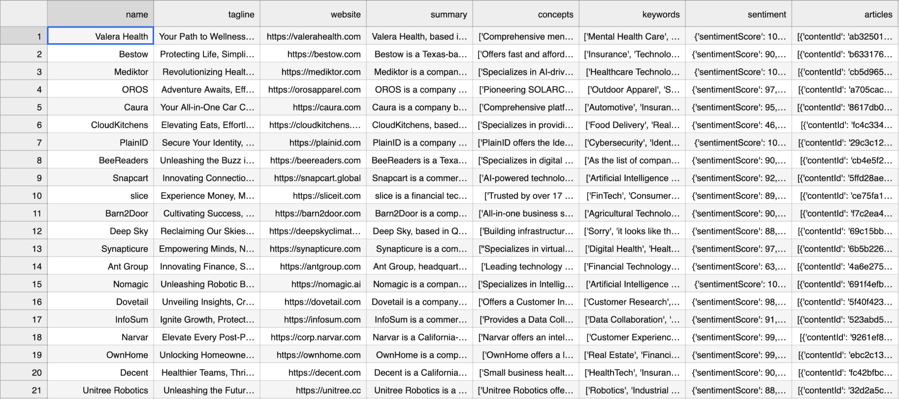

# Section 1

**File:** Will-K-Means.ipynb

**Goal**: Generate clusers using K-Means for data in `primary.csv`.

**Reason**: After our Data Exploration phase and visualizing correlations (or the lack thereof) with different numerical variables revealed that it might be difficult to find any strong explanatory variables from our scraped dataset. For this reason, our first step was to generate clusters of data from a K-Means approach, to try and discern whether our dataset contained any identifiable groups with relevant features that would be worth predicting.

**Preprocessing:**

Before implementing the K-Means model, some processing had to be done on the dataset. Below is a snippet of what the dataset looked like before processing:

text **test** 2

*test*

> test
>
> test 2

test

1. test
2. test

_test_

1. test

<a href="https://wihi1131.github.io/Data-Mining-Project/">Home</a>
