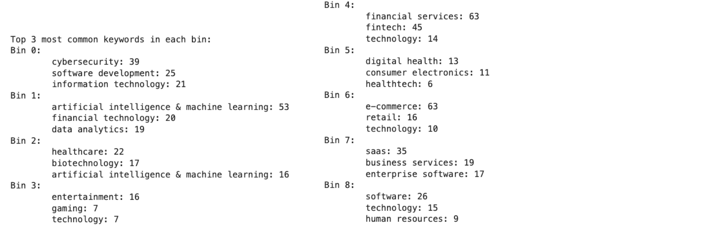

# Overview

This page is organized into six sections. The authors of each section are:

| Name      | Sections          |
| --------- | ----------------- |
| Will      | Section 1 & 2     |
| Michael   | Section 3, 4, & 5 |
| Melina    | Section 6         |

The sections have different goals, preprocessing steps, and models. Some sections contain multiple models. In total, we created nine models. Each section also discusses our reasoning for the section and finishes off with a conclusion.  

Overall, the objective of this milestone was to train machine learning models to recognize patterns in our datasets and then validate these models with test data. Using these models, we can make predictions on inference sets containing samples that our models have not seen before. This is powerful because it enables us to predict how successful a company is likely to be based on preliminary data, the results of which can then be used to modify their strategy if needed. All model files are in the `Model Building` folder in the GitHub repository.  

## Jump to a Section

> <a href="#section-1">Section 1</a>
>
> <a href="#section-2">Section 2</a>
>
> <a href="#section-3">Section 3</a>
>
> <a href="#section-4">Section 4</a>
>
> <a href="#section-5">Section 5</a>
>
> <a href="#section-6">Section 6</a>

___

# Section 1

**File:** `Will-K-Means.ipynb`

**Goal**: Generate clusers using K-Means for data in `primary.csv`.

**Reason**: After our Data Exploration phase and visualizing correlations (or the lack thereof) with different numerical variables revealed that it might be difficult to find any strong explanatory variables from our scraped dataset. For this reason, our first step was to generate clusters of data from a K-Means approach, to try and discern whether our dataset contained any identifiable groups with relevant features that would be worth predicting.

## Preprocessing

Before implementing the K-Means model, some processing had to be done on the dataset. Below is a snippet of what the dataset looked like before processing:

Note that this snippet does not contain all columns of the dataset. 

### Transformation:

Notice the presence of many columns containing long strings or dictionaries of text information. K-Means models can only be conducted with numerical data. Our data contained a column called ‘sentiment’ with string values containing a numerical score along with explanations and other indicators of sentiment, such as numbers of positive/negative words within each article. It was decided that sentiment score might be a useful attribute to try and create clusters from, so the numerical part of this string needed to be separated. This numerical score was first extracted and put into a new column with the following code:  

After creating this column, all numerical columns were defined and isolated:

Two significant outliers were also identified, and dropped from the dataset:

It is standard practice to implement scaling of values for K-Means clustering models, so a StandardScaler from Scikit-learn was also used. Below shows a snippet of the implementation of scaling, and how the scaled data looked before K-Means was performed:

## Modeling

### K-Means Clustering:

First, we much implement K-Means and select a value for K. Many values of K were tested, and the clusters were visualized in two dimensions using principal component analysis. From visualizations that were only possible from reducing the dimensions to two, a value for K = 3 was chosen. Since the outcome of the k-means clustering was, for us, a somewhat exploratory measure, we believe this makes sense over other potential values of k which could have been chosen based off of other metrics, as we will discuss below.  

A K-means model with 3 clusters divided the data into the following groups:

Using Principal Component Analysis, the dimensions of each of these groups was reduced to two for visualization purposes:

The visualizations of these dimension-reduced clusters, with each cluster colored differently, is as follows:

We can see that most of the data belongs to either Cluster 1 or 2, and these clusters are close to each other when visualized. The most interesting cluster for our analysis is Cluster 0. Though this cluster contains the least amount of data points, and those data points have a large spread, they clearly are distinguished from Clusters 1 and 2, having the highest values of the two principal components.  

We can understand this difference further by looking at means of the attributes of the data in each cluster:  

We can see that Cluster 0 is characterized by the highest means of investor counts, total funding, the last funding amount (the last two by far), and, interestingly, a lower sentiment score than the other two clusters. We also note the similarity with the year founded and funding count as Cluster 1, and a lower magnitude mosaic change than Cluster 1. This paints the following picture: Cluster 0 appears to contain startups that have been around for 9-10 years, but, in contrast to startups in Cluster 1, have more investors and vastly more amounts of funding (though they have had the same rounds of funding as those startups in Cluster 1), a smaller change in mosaic score than Cluster 1, and a noticeably lower sentiment score than either other cluster. We might expect Cluster 2 to have the lowest numbers of investors and funding numbers, since their mean founding year is much more recent. However, the founding year for startups in Cluster 0 is very close to that of Cluster 1, and yet financial metrics for startups in Cluster 0 are significantly better. The difference in mean sentiment score for Cluster 0 startups is particularly intriguing. It may be that the more successful startups in Cluster 0 simply have more press written about them as opposed to other startups, and more press may contain negative sentiment. This could be a direct implementation of the old maxim: “any press is good press”. In other words, more successful startups may have more negative things written about them, but at least this means they get more media coverage, and this translates to much more funding than other startups.  

With all this in mind, we decided the prediction of many of our subsequent models would be to predict the cluster grouping that was generated from this K-means model. 

In terms of hyperparameter tuning, other values for K were considered but were not used due to being less interpretable for further model building and prediction.  

A graph using the elbow method for finding an optimal value of K was generated for consideration:

We can see there is not any definitive value of K for which the slope of this curve drastically decreases from one value of K to the next – the decrease in distortion is gradual throughout. The largest decreases in the slope appear to occur between k = 2 and k = 3, and between k = 6 and k = 7.   

A visualization of using k = 7 with PCA to reduce dimensions to 2 is as follows:

We can see a huge amount of variability within the large ball of data that was previously only divided into 2 clusters for K = 3, and the former cluster for Cluster 0 at K = 3 is also divided, with brown points of Cluster 5 being mixed in to the red points of Cluster 3 in the above graph.  

## Conclusion

Though it may be interesting to use such a clustering in a further analysis beyond the scope of this project, it was decided that it would be sufficient to use K = 3 and attempt to find ways to predict any data found to be in Cluster 0, as this appears to have enough interesting differences (from the examination of the means of attributes for data in that cluster) to make predictive models focusing mostly on finding startups that fit into this cluster. 

<a href="#sections">Back to top</a>

___

# Section 2

**File:** `Will_DM_NN.ipynb`

**Goal**: Use neural network to predict clusters found with K-Means for data in `primary.csv`. 

**Reason**: After creating the clusters, we created a neural network to make predictions of which companies belong to which clusters. This network looks at numerical features when making a decision.

## Preprocessing

A new dataset was created after K-Means clustering was performed, including the cluster of each datapoint. The below image is a snippet of that data:  

Note the cluster column on the right-hand side, showing the cluster each data point belongs to.

### Transformation:

Like before, and to keep the model consistent, we used only numerical columns for the neural network:  

We split the data into training and testing sets, and, like before, used standard scaling, as this is generally best practice for training neural networks: 

Below is a snippet of how the training data looked before the neural network model was trained on it:  

## Modeling

### Neural Network:

A very basic and straightforward neural network model with two hidden layers and an output layer was created using the Keras library, which runs on top of TensorFlow, another python library. This was used as a classifier to predict the three classes corresponding to the three k-means clusters we found previously. We decided to use a standard ReLU activation function for hidden layers and a softmax function for the output layer, because these are suitable for basic classification models such as this. 

We omitted more complex techniques such as regularization, dropout, or batch normalization, since this was meant to be a baseline model that could potentially be optimized later. The architecture of the model is simple, with only three layers: one hidden ReLU layer with 64 neurons, another hidden ReLU layer with 32 neurons, and an output layer with softmax activation with 3 neurons, suitable for classification. The optimizer (Adam) and loss function (sparse categorical cross-entropy) are both commonly used. The sparse categorical cross entropy function is able to be used here since the labels for the clusters are provided as integers.

We monitored accuracy during training and evaluation. Nine epochs were chosen after initially trying 30 and noticing an area where the loss function ceased to decrease around nine epochs. Note the training data was also split into a 0.1 size validation set to help prevent overfitting. Overall, this model was created to be extremely basic and as a baseline for further optimization if deemed necessary. Below is the code used, the output of each epoch, and a confusion matrix to evaluate performance:  

Surprisingly, we saw an extremely high rate of accuracy of prediction even though no class balancing was performed on the data and despite the simplistic nature of the neural network. Note the final accuracy on the test set was 0.9873. We can also examine the confusion matrix above. We can see the only errors are 6 predictions that an item would be in class 0, but was actually in class 1, 7 items predicted to be in class 2, but were actually in class 1, and only 1 item predicted to be in class 0, but was actually in class 2. Since Class 0 is our interesting class and the one that would likely yield startups most likely to receive large amounts of funding, we likely don’t care much about incorrect predictions of class 2 items that were actually in class 1. We do see that this neural network tends to place some items in class 0 that do not belong there – considering the rarity of a startup actually belonging to class 0, this may be a bit concerning should this model be introduced to new data (7 wrong predictions out of 45 predicted to be in Class 0 would give us a 15% likelihood that our model might tell us to invest in a Class 0 company that is not actually classified as one). Of course, since we are predicting clusters and not actual performance of a company, it is entirely possible that a Class 1 or 2 company might contain some metrics like funding amount that would be favorable, even if they are not within our ‘interesting’ cluster. And, regardless, an 85% accurate prediction for Class 0 is still very good considering how imbalanced the classes are in this case.  

## Conclusion

Our model performs extremely well without the need for class balancing or adjustment of a very simple neural network. With such an excellent accuracy score, we should be wary of possible overfitting. The best way to uncover overfitting would be to find out how well this model performs on brand-new, unseen data. 

<a href="#sections">Back to top</a>

___

# Section 3

**File:** `Michael-ML-Clusters.ipynb`

**Goal**: Predict clusters found with K-Means using classification on `primary.csv`.

**Reason**: Given an unseen sample, we want to be able to predict its cluster based on its features. This section is not necessarily applicable to real world problems, because 1) we could have just added the point to the dataset then used K-Means to predict its cluster, and 2) there would be few unseen samples with all the features used to train our model. Nonetheless, this section helps us test our processing pipeline and model outputs, so we feel it is necessary to showcase.

## Preprocessing

Preprocessing is performed on both the training set and test set. Typically, encodings and scalings are first fit on the training set, then the data in both the training set and test set are transformed. By doing this, we ensure there is no data leakage, and that the test set can be processed by the model.

### 1. Loading:

First, we load the dataset and split it into a feature matrix and a target vector. Then we split those into training and test sets.  

Incomplete snippet of initial training dataset features:

Initial training dataset target counts:

### 2. Encoding:

Next, we encode the categorical features, which transforms them into numerical features, which is needed for training certain models. To do this, we look at the cardinality of each categorical feature (number of unique values).  

We encode the features accordingly. Here are the encodings:

### 3. Augmenting:

Next, we can optionally augment our feature matrix. However, after training the models, we found that in this case, augmentations did not significantly affect model performance.  

### 4. Balancing:

Now, we can balance our data such that each class in the target vector is represented by roughly the same number of samples. To do this, we use SMOTE oversampling. Visit [https://machinelearningmastery.com/smote-oversampling-for-imbalanced-classification/](https://machinelearningmastery.com/smote-oversampling-for-imbalanced-classification/) for more details.  

### 5. Scaling:

Finally, we scale our feature columns (all of which are now numerical). To help with this, we created a scale previewer. From a dropdown, we can select a feature and a scaling method, and the previewer will show how the data distributions for both the training and test set look before and after the feature is scaled. For example, `year_founded` can be scaled to be more normal using quantile scaling.

Another example is that `sentimentScore` can be scaled between 0 and 1 using min-max scaling. 

After we previewed different scaling methods for each feature, we scaled the features accordingly. Here are the scalings:

Now, our features are near 0 (helps distance models like K-Means and SVM).

## Modeling

### 1. Decision Tree:

We start off with a decision tree; it is interpretable and tests our data viability. We start with an initial maximum depth of 3. We have three classes, so we use One-vs-Rest when making the ROC Curves.

We can see that our F1 Score is already quite high. We can also see that the feature that results in the greatest information gain when split on is `last_funding_millions`. It seems like funding information and founding information are the features the decision tree uses to determine which cluster a company belongs to. Using hyperparameter tuning, we can push our F1 Score even higher. 

We can see that with hyperparameter tuning, which uses 5-fold cross validation, our new maximum depth is 10. An F1 Score of 0.941 is excellent for a multiclass classifier, and an AUC near 1 for all the ROC curves shows that this model is well suited to predicting clusters. 

### 2. Support Vector Machine (SVM):

We follow the same approach with an SVM. By using an SVM, we test if our scaling is sufficient, since SVM is affected by distance, given that it tries to find a hyperplane dividing the data.

Here are the results without any scaling:

Here are the results with scaling:

In addition to performing better, the SVM on the scaled data runs much faster. 

With hyperparameter tuning, we can achieve an even greater F1 Score for the SVM on the scaled data.

## Conclusion

Using a decision tree and support vector machine on our primary dataset to predict which cluster each company belongs to worked well. The tuned decision tree had an F1 Score of 0.941, and the tuned SVM had an F1 Score of 0.930. We also tested the viability of creating models on our datasets and developed a preprocessing pipeline. Finally, we saw firsthand the effect that scaling has on distance-based model accuracy. The next two sections use the companies from our primary dataset that had valuation information. The models created are more applicable for real-world inference, because we drop circular features, such as total funding when trying to make predictions. Instead, we use information that companies without much funding information would have, such as their industry, location, year founded, and latest funding. 

<a href="#sections">Back to top</a>

___

# Section 4

**File:** `Michael-ML-Valuation-2Bins.ipynb`

**Goal**: Using classification on `primary-with-valuation.csv`, predict whether a company will be in the lower half or upper half of valuations. 

**Reason**: While the decision tree and SVM for predicting clusters were successful, they are not applicable to inferring company success on unseen, real-world data. This is because they use features that are either unavailable or circular in nature for most companies. For this section, we first divide the valuation amounts into two bins, low and high, and then use realistically obtainable features to predict whether a company will end up with a low or high valuation.

## Preprocessing

The preprocessing for this section follows a similar process to the preprocessing in section 1. The differences occur in the encoding and augmentation of the data.

### 1. Encoding:

We drop features such as total funding and investor count; these are circular when predicting valuation. 

### 2. Augmenting:

Here is the interesting part. Since we dropped so many features that were used by past models to determine clusters, we need to augment our dataset with new features that give it more information. Our approach to this was to encode the keywords column, which contains industry information for each company, so that the model can use industry area when classifying. 

We start by one-hot encoding all the keywords in each list for each company using Scikit-learn's `MultiLabelBinarizer`. Then we use Scikit-learn's `TfidfTransformer` to reduce the effects of our sparse one-hot encoded matrix. Then, we use `KMeans` to cluster similar points in our one-hot encoded vector space. Finally, we one-hot encode the keyword bins formed by K-Means. 

With the top 3 most common keywords in each bin, we use `networkx` to create a graph to connect keyword bins to keywords. Using our clustering algorithm, we have created clusters with keywords that are conceptually tangential, ie. Bin 0 has Cybersecurity, Software Development, and Information Technology, while Bin 6 has E-commerce, Retail, and Technology. 

## Modeling

### Random Forest:

We use a random forest model because it avoids overfitting and had the best performance.

With 100 trees, the F1 Score is decent, and with hyperparameter tuning becomes slightly better.

## Conclusion

Our random forest model did a good job of deciding whether a company would have low or high valuation based on our modified feature set. Using this model, given an unseen company, we could decide with moderate confidence whether they would end up with a low or high valuation.  

<a href="#sections">Back to top</a>
___

# Section 5

**File:** `Michael-ML-Valuation-3Bins.ipynb`

**Goal**: Using classification on `primary-with-valuation.csv`, predict whether a company will have a low, medium, or high valuation.

**Reason**: While the previous section created a model that predicts whether a company will end up with a low or high valuation, it would be even more helpful to predict whether a company will end up with a low, medium, or high valuation. In this section, we create three bins for valuation and train a classifier to predict these bins.

## Preprocessing

The preprocessing for this section is identical to that of the previous section.

## Modeling

### Logistic Regression:

We use a logistic model because it is interpretable, which is useful for determining how our keyword bins influence the model. Here are the bins again:

Class 0, Class 1, and Class 2 correspond to low, medium, and high valuations. Below, in our tuned logistic regression model, we see that the model is more likely to classify companies in Bin 8 as Class 0 (lower valuation). Bin 8 includes software, technology, and human resources. Compared to other bins, it makes sense that human resources would have lower valuations. Looking at Bin 5, we see that the model is more likely to classify these companies as either Class 0 or Class 2. It is much less likely to classify them as Class 1. In other words, since this bin includes digital health, consumer electronics, and healthtech, the model sees healthcare companies as more likely to either have low or high valuations, with fewer in the middle.  

## Conclusion

Our random forest model did an okay job of deciding whether a company would have low, medium, or high valuation. Using this model, given an unseen company, we could decide with some confidence whether they would end up having a low, medium, or high valuation. 

<a href="#sections">Back to top</a>
___

# Section 6

**File:** `Mel ML Project Models.ipynb `

**Goal**: Use regressions to predict the valuation of a company using data in `primary-with-valuation.csv`.

**Reason**: We used classifiers to predict valuation bins, but we did not yet have a way to predict actual valuation amounts given a feature set. In this section, we use regressors to accomplish this task.

## Preprocessing

Here is an incomplete snippet of the dataset before preprocessing: 

### Transformation:

As we were plotting regression models, we wanted to focus on the numerical attributes, so we dropped the columns that couldn’t contribute, including the name, keywords, concepts, articles, and website.  

With the remaining columns, we looked at the attribute types to decide if any encoding needed to be done if the columns weren’t float or integer types. The city, valuation date, and sentiment score were object types, so we decided to use target encoding. We chose this over any other type because we assumed that there would be relationships between those attributes and the target feature, valuation in millions.  

Before training our SVR model, we scaled the features for better performance and hypertuned the parameters using GridSearchCV, which printed out the best epsilon and C values. The SVR had a great R-squared score of around 99%, an improvement from before finetuning parameters. The KNN model performed much better without scaled features, so we used the unscaled training and test features. We also set the weights equal to distance because it gives more importance to closer neighbors to make predictions. This also reduces the impact of farther neighbors, or outliers in this case that we did not want to drop. If we had dropped the outliers for the KNN, the R-squared score would have been better, but we would lose what we’re looking for in the data. As more data is collected and trained, this data point may no longer be an outlier and improve the overall predictive power of the model.   

Here is the dataset after preprocessing: 

## Modeling

### 1. Support Vector Regression (SVR):

We used a support vector regression to predict the valuation in millions of companies. First, we scaled the parameters then hyper-tuned them using GridSearchCV to find the best C and epsilon values. Epsilon defines a margin of tolerance for the model and C determines the trade-off between the bias and variance.

### 2. K-Nearest Neighbors (KNN) Regression 

We made a plot and used the elbow method to determine the optimal number of clusters for high accuracy. We found the best clusters to be three and obtained decent r-squared values. The reason it is not higher is due to an outlier in the data, but we wanted to keep the outlier to visualize the companies that performed better than expected.

## Conclusion

Using SVR and KNN regressors, we were able to predict valuations with quite high accuracy. For the SVR regressor, we had an r-squared value of 0.997, which is very high. For the KNN regressor, we had an r-squared value of 0.755, which is moderately high. 

<a href="#sections">Back to top</a>
___

<a href="https://wihi1131.github.io/Data-Mining-Project/">Home</a>

