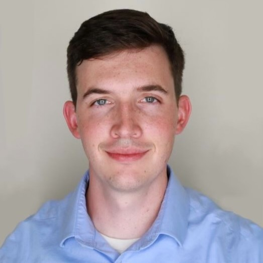
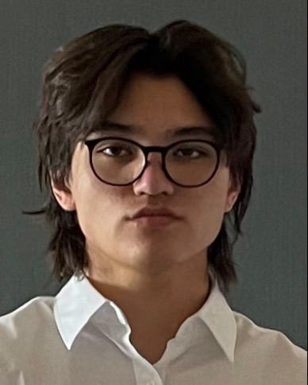

Team Members: 

# William Hinkley 

## Bio: 
- William has a background in both Ecology/Evolutionary Biology and Applied Computer Science from the University of Colorado, Boulder. He was born and raised in Littleton, CO. He enjoys hiking, boxing, and gaming in his free time.
- 
<a href="https://www.linkedin.com/in/williamhinkley2/">LinkedIn</a>

# Michael V.

## Bio:
- Michael has a B.S. in Computer Science from UCLA. He is currently studying Data Science at CU Boulder. Coming from Colorado, he loves taking trips to the mountains, biking, and photography.

<a href="https://www.linkedin.com/in/michael-van-vuuren/">LinkedIn</a>

# Melina K. 

## Bio: 
- Melina got her undergraduate degree in Biophysics from Texas Christian University and is currently pursuing her Master's in Data Science at the University of Colorado Boulder. Originally from Wisconsin, she enjoys running, water sports, and trying out new restaurants with friends.

<a href="https://www.linkedin.com/in/melina-kopischkie-453ba6229/">LinkedIn</a>

<a href="https://wihi1131.github.io/Data-Mining-Project/">Home</a>
